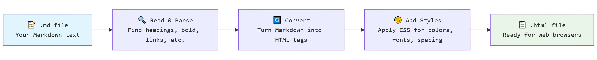

<!-- _class: cover_c -->
<!-- _footer: "Made with Awesome-Marp (Github)" -->
<!-- _header:  -->
<!-- _paginate: false -->

# Markdown Language
###### Theory, Tools, and Live Implementations

**Seminar Presentation**
Presented by  
Name: [My Name]
Reg. No.: [My Reg. No.]

---

<!-- _header: "CONTENTS" -->
<!-- _class: toc_a -->
<!-- _footer: "" -->
<!-- _paginate: false -->

- Introduction to Markup Languages
- Understanding Markdown
- Why Choose Markdown
- History & Flavors
- Markdown in Action
- Tools & Workflow
- Markdown vs GUI Tools
- Real-World Applications
- Future of Markdown and importance of AI
- References Used
- Q&A

---

<!-- _class: trans -->
<!-- _paginate: false -->

## 1. Introduction to Markup Languages

---

## 1. Introduction to Markup Languages

###### **What is a Markup Language?**

- A **Markup Language** adds symbols to plain text to style and display it in a particular manner.

###### **Common Examples of Markup Languages**

- **HTML** – Used to make web pages.
  - Example: `<h1>Hello World</h1>`

- **XML** – Used to store and share data.
  - Example: `<note><to>Sreerag</to></note>`

---

<!-- _class: trans -->
<!-- _paginate: false -->

## 2. Understanding Markdown

---

## 2. Understanding Markdown

###### **What is Markdown?**

- A lightweight markup language that makes writing formatted text simple.
- Easy to write and read, even without special software.
- You can just open it in a normal text editor and you can see it's contents.
- **The main purpose of Markdown is to be converted into HTML.**

###### **How does it work?**

- You add simple symbols like `#` or `*` to style text.

###### **Example:**

```markdown
This is normal text with no styling
# This one is a Level 1 heading
**This is bold text**
```

---

<!-- _class: caption -->

## 2. Understanding Markdown - A Pictorial Example

- You write Markdown text in a text editor. You save it with `.md` file extension.


<div class="caption">
Markdown text in VS Code
</div>

---

<!-- _class: caption -->

## 2. Understanding Markdown - A Pictorial Example

- Then you convert it into HTML or PDF file using an appropriate tool.
- If you are doing a presentation in Markdown, a tool like [Marp](https://marp.app/) is a good choice.


<div class="caption">
Markdown text converted to HTML using Marp
</div>

---

<!-- _class: caption -->

## 2. Understanding Markdown - A Pictorial Example

- And finally, you render it.


<div class="caption">
Picture of a puppy
</div>

---

## 2. Understanding Markdown - Pictorial Example Breakdown


---

## 2. Understanding Markdown - Pictorial Example Breakdown

- The following images represents what happens behind the scenes when an `.md` file is being converted to HTML.



---

<!-- _class: trans -->
<!-- _paginate: false -->

## 3. Why Choose Markdown

---

<!-- _class: cols-2 -->

## 3. Why Choose Markdown


<div class=ldiv>

- Simple & Fast
  - You don’t need long HTML codes. A few symbols can do the same job.
- Readable Anywhere
  - Markdown is just plain text, so it works on any device or editor.
- Free & Open Source
  - No need for paid tools like Word or Canva. Markdown is completely free.
- Flexible
  - You can write notes, documents, slides, blogs, or even books with it.
- Career Boost
  - Learning Markdown also helps you learn HTML, CSS, and coding skills that many jobs need.

</div>

<div class=rimg>


</div>

---

<!-- _class: trans -->
<!-- _paginate: false -->

## 4. History & Flavors

---

<!-- _class: cols-2 -->

## 4. History & Flavors

<div class=ldiv>

###### **History of Markdown**

- It was actually just a [Perl](https://www.perl.org/) script created by **John Gruber** in **2004**
- The purpose was to make text formatting [easy to read and write.](#13)
- The original design idea was to make it “as readable as plain text, even before being rendered.”
- It is still used today in blogs, documentation, notes, and presentations (like this one). On the right is a screenshot from the documentation page of [Obsidian](https://help.obsidian.md/)

</div>

<div class=rimg>


</div>

---

<!-- _class: cols-2 -->

## 4. History & Flavors
<div class="ldiv">

###### **What Are Markdown Flavors?**

- Flavors are different sets of rules that define how Markdown symbols work.
- Flavors decide what syntax applies which format to the text.

###### **Why do they exist in the first place?**

- The original Markdown was simple and lacked some useful features like tables, checklists, or math formulas.
- The newly created flavors added these features.
- Examples of such flavors include:
  - [LaTeX](https://www.latex-project.org/about/)
  - [Github Flavoured Markdown (GFM)](https://github.github.com/gfm/)

</div>

<div class=rimg>


</div>

---

## 4. History & Flavors

###### **CommonMark Syntaxes and their Equivalent in HTML**

| Element          | Markdown Syntax                               | HTML Equivalent                                  |
|------------------|----------------------------------------------|------------------------------------------------|
| **Heading**      | `# H1`<br>`## H2`<br>`### H3`              | `<h1>H1</h1>`<br>`<h2>H2</h2>`<br>`<h3>H3</h3>`|
| **Bold**         | `**bold text**`                            | `<strong>bold text</strong>`                  |
| **Italic**       | `*italicized text*`                        | `<em>italicized text</em>`                    |
| **Blockquote**   | `> blockquote`                              | `<blockquote>blockquote</blockquote>`         |
| **Ordered List** | `1. First item`<br />`2. Second item`<br>`3. Third item` | `<ol><li>First item</li>`<br />`<li>Second item</li>`<br />`<li>Third item</li></ol>` |
|continued in next slide...

---

## 4. History & Flavors

###### **CommonMark Syntaxes and their Equivalent in HTML**


| Element          | Markdown Syntax                               | HTML Equivalent                                  |
|------------------|----------------------------------------------|------------------------------------------------|
| **Unordered List**| `- First item`<br>`- Second item`<br>`- Third item` | `<ul><li>First item</li>`<br />`<li>Second item</li>`<br />`<li>Third item</li></ul>` |
| **Code**         | `` `code` ``                                | `<code>code</code>`                            |
| **Horizontal Rule**| `---`                                     | `<hr>`                                        |
| **Link**         | `[title](https://www.youtube.com/)`          | `<a href="https://www.youtube.com/">title</a>` |
| **Image**        | ``                   | ``        |

---

<!-- _class:  bq-blue -->

## 4. History & Flavors

###### **Common Flavors and Implementations**

- An **implementation** is a program or library that follows a flavor’s rules, written in a specific programming language (like C, JavaScript, Python).
- Example: CommonMark has implementations in many languages to keep behavior consistent.

> CommonMark and Why it is different from the rest of them flavors
>
> - The original Markdown script didn't have mechanism that defined what to do in certain scenarios, like nested bold text, or bold text within italics, etc.
> - CommonMark was created to remove ambiguity in the original Markdown rules.
> - Unlike other flavors, it does not introduce new features—it only standardizes syntax.

---

## 4. History & Flavors

###### **Examples of some flavors include:**

| **Flavor**                                                | **Description**                       |
| :--------------------                                     | ------------------------------------: |
| **Original Markdown**                                     | First spec; loose and ambiguous       |
| **CommonMark**                                            | Standardized to remove ambiguity      |
| [**GFM**](https://litter.catbox.moe/xoq2za.png)           | GitHub’s version; adds tables & lists |
| **Markdown Extra**                                        | Adds tables, footnotes                |
| **Pandoc**                                                | Extended; supports math & slides      |
| **R Markdown**                                            | For R; runs code blocks               |
| **Markua**                                                | For writing technical books           |
| **Typora**                                                | Typora’s version; adds diagrams, math |
| ...and many more (This is already too much)                                                       |


---

## 4. History & Flavors

###### **Some of them flavors and how they were developed over time:**


---

## 4. History & Flavors

###### **Examples of some implementations include:**

| Implementation      | Language    | Flavors Supported                         |
| :------------------ | :---------: | ----------------------------------------: |
| **cmark**           | C           | CommonMark                                |
| **commonmark.js**   | JavaScript  | CommonMark                                |
| **marked**          | JavaScript  | GFM (supports extensions)                 |
| **markdown-it**     | JavaScript  | GFM + plugins for more                    |
| **Pandoc**          | Haskell     | Pandoc Markdown + others                  |
| **Remark**          | JavaScript  | GFM + CommonMark (extensible via plugins) |
| **Marp**            | Node.js     | Markdown for presentations                |

---

<!-- _class: trans -->
<!-- _paginate: false -->

## 5. Markdown in Action

---

## 5. Markdown in Action

##### **Basic Syntax Examples**

Some of the most commonly used Markdown features are:

- **Headings** (`#`, `##`, `###`)
- **Paragraphs** and **line breaks**
- **Italic & Bold text** (`*` and `**`) 
- **Blockquotes** (`> `)
- **Horizontal rules** (`---`)

```markdown
# Heading 1
## Heading 2
**Bold Text** and *Italic Text*
> This is a blockquote
---
```

---

1. **Lists** - List syntax is used to create ordered and unordered lists.

###### Example:

```markdown
- Item 1
- Item 2
  - Nested Item

1. First
2. Second
```

###### Output

- Item 1
- Item 2
  - Nested Item

1. First
2. Second

---

2.  **Links & Images** - Add clickable text pointing to a URL and add embed pictures.

###### Example:

```markdown
[Markdown](https://en.wikipedia.org/wiki/Markdown)


```

###### Output

[Markdown](https://en.wikipedia.org/wiki/Markdown)


---

3. **Code Blocks** - Show code snippets inline or in fenced blocks.

###### Example:


<pre>
```c
#include<stdio.h>
int main() {
  printf("This is a code blocks!\n");
  return 0;
}
```
</pre>

###### Output

```c
#include<stdio.h>
int main() {
  printf("This is a code blocks!\n");
  return 0;
}
```

---

4. **Tables** - Pretty much self-explainable.

###### Example:

```markdown
| Vegetable     | Price |
| :------------ | ----: |
| Onion         |   100 |
| Beans         |   100 |
```

###### Output

| Vegetable     | Price |
| :------------ | ----: |
| Onion     |   100 |
| Beans         |   100 |

---

<!-- _class:  bq-black -->

5. **Task Lists** - Add Checkboxes within which you can mark.

###### Example:

```markdown
- [x] Write section
- [ ] Review content
- [ ] Submit final report
```

###### Output

> This syntax is NOT supported in Marp because it wouldn't make sense to add a checklist in a presentation-based implementation.

---

<!-- _class: trans -->
<!-- _paginate: false -->

## 6. Tools & Workflow

---

<!-- _class: cols-2-46 -->

## 6. Tools & Workflow

<div class=ldiv>

- The following **tools** can be used to write Markdown files.
  - [**VS Code**](https://code.visualstudio.com/) – For writing and editing `.md` files
  - [**Obsidian**](https://obsidian.md/) – For note-taking and organizing Markdown files
  - [**MarkText**](https://github.com/marktext/marktext) – For distraction-free Markdown writing
  - [**Marp**](https://marp.app/) – For creating presentation slides from Markdown
  - [**GitHub**](https://github.com/) **/** [**Git**](https://git-scm.com/) – For version control and collaboration

</div>

<div class=rimg>


</div>

---

## 6. Tools & Workflow

- Here is how you manage and process Markdown files.
  1. Write in Markdown using VS Code, Obsidian, or MarkText
  2. Preview and Style content in chosen tool
  3. Export or Convert to desired format (e.g., PDF, HTML, PPTX)
  4. Optional but **pivotal**: Add CSS for custom styling
  5. Use Marp to generate presentation slides from `.md` files

- The best thing is that:
  - All tools are free and open source
  - Cross-platform and lightweight compared to Word or Canva
  - Markdown files are plain text files, the only difference being it has a `.md` file extension. This means you can open them in almost any text editor and voila! you get your content.

---

<!-- _class: trans -->
<!-- _paginate: false -->

## 7. Markdown vs GUI Tools

---

## 7. Markdown vs GUI Tools

| Feature             | Markdown Tools (e.g., Marp, Obsidian)       | GUI Tools (e.g., Word, PowerPoint, Canva)     |
| ------------------- | ------------------------------------------- | --------------------------------------------- |
| **Cost**            | Free & open-source                          | Often paid or subscription-based              |
| **Portability**     | Plain text files; open anywhere             | Requires specific software                    |
| **File Size**       | Very small (.md files)                      | Large (.docx, .pptx)                          |
| **Ease of Writing** | Uses simple syntax                          | WYSIWYG, no syntax knowledge needed           |
| **Flexibility**     | Can integrate HTML/CSS/JS for custom styles | Limited design customization                  |
| **Version Control** | Works great with Git                        | Harder to track changes                       |
| **Learning Curve**  | Requires learning Markdown syntax           | Easier for beginners                          |
| **Output Formats**  | Can export to PDF, HTML, slides easily      | Limited export formats                        |
| **Collaboration**   | Easy via GitHub or text editors             | Built-in features like comments, co-authoring |

---

<!-- _class:  bq-blue -->

## 7. Markdown vs GUI Tools

In short...

- Advantages of Markdown Tools
  - Free, lightweight, and portable
  - Works well with coding workflows
  - Supports automation and templates

- Advantages of GUI Tools
  - Beginner-friendly, no syntax knowledge
  - Rich visual interface with drag-and-drop
  - Comes with built-in templates and assets

> GUI tools are great for quick, design-heavy tasks, while Markdown tools excel in speed, flexibility, and technical workflows.

---

<!-- _class: trans -->
<!-- _paginate: false -->

## 8. Real-World Applications

---

## 8. Real-World Applications

- Markdown can be used for many real-world applications.
- It can be used to create and manage notes, blogs, reports, presentations, and more.
- It's used by developers, writers, and teams worldwide.

###### **Common Use Cases**

- **Note-taking** → [Obsidian](https://obsidian.md/), Joplin
- **Reports & Docs** → [MarkText](https://github.com/marktext/marktext), Typora, [GitHub Wiki](https://docs.github.com/en/communities/documenting-your-project-with-wikis/about-wikis)
- **Blogs & Books** → Ghost, Leanpub
- **Presentations** → [Marp](https://marp.app/)
- **Project Management** → GitHub Issues, Trello

---

<!-- _class: trans -->
<!-- _paginate: false -->

## 9. Future of Markdown and importance of AI

---

## 9. Future of Markdown and importance of AI

- We live in the age of AI. Everything is becoming smarter.
- AI can take your raw ideas and turn them into clean, formatted Markdown.
- Perfect for docs, reports, blogs, and technical content.
- Saves time → Less typing, more creating.

###### **Future Possibilities of Markdown with AI**

- **AI-assisted Slides** → Write a topic, AI creates a Markdown-based presentation.
- **Smart Formatting** → AI converts plain text into tables, charts, and diagrams.
- **Content Generation** → AI + Markdown = quick blogs, wikis, and notes.
- **Interactive Docs** → AI brings dynamic elements inside Markdown files.

---

## 9. Future of Markdown and importance of AI

##### CONCLUSION

> Why This Matters
>
> - Markdown is simple. AI makes it smarter and faster.
> - In today’s world, speed and efficiency matter more than ever.
> - Combining Markdown with AI means:
>     - No more repetitive formatting.
>     - Focus on ideas, not syntax.
>     - Create professional content in minutes, not hours.
> - The future of writing, teaching, and documentation is AI-powered Markdown.
> - Learning Markdown today means staying ahead tomorrow.

---

<!-- _class: trans -->
<!-- _paginate: false -->

## 10. References Used

---

## 10. References Used

1. [The Markdown Guide by Matt Cone (book)](https://www.markdownguide.org/book/)
2. [Obsidian Documentation](https://help.obsidian.md/)
3. [Marpit Documentation](https://marpit.marp.app/)
4. [Mermaid Documentation on Flowchart and Timeline syntax](hhttps://mermaid.js.org/intro/)
5. [MarkText Documentation](https://github.com/marktext/marktext/blob/master/docs/README.md)
6. Reddit
7. ChatGPT
8. Claude

---

<!-- _class: lastpage -->

###### THANK YOU~

<div class="icons">

<i class="fa-brands fa-github fa-2xl"></i>&nbsp; [Link to the project repo](https://github.com/grassy345/seminar_presentation)

<div>